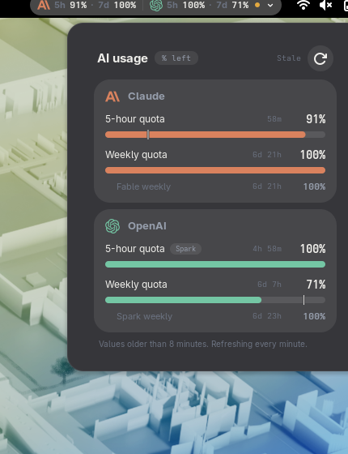

# Burnline

GNOME Shell extension that shows how much of your Claude and OpenAI Codex quota is left. The top bar gets one group per provider: the provider icon, then `5h` and `7d` with the percentage of that window still unused (highest usage wins when several accounts report). A dot appears next to them when the numbers are stale or a provider returned nothing. The popup lists each provider's 5-hour and weekly quota as a depleting meter with the time until the window resets and the percentage left, adds a row per model-scoped limit, and ends with a line that is either the fault of the moment or a legend for the pace notch. The numbers come from a command you configure; the extension holds no credentials and makes no provider requests.



Verified on GNOME Shell 50.4 on Fedora. Nothing else has been tried.

## The pace notch

Each meter is the quota *remaining*, filled from the left, so the bar empties as the window burns. The hairline cut through it marks the quota an even burn would have left at this moment in the window. Bar longer than the notch: you are ahead of pace. Bar shorter than the notch: at the current rate the quota runs out before the window resets.

`paceFraction()` in `usage.js` computes the share of the window already elapsed as `(durationMs - (resetsAt - now)) / durationMs`, and the notch is drawn at `1 - paceFraction` of the rail width. It returns `null`, and no notch is drawn, when `resetsAt` is not a finite number, when `durationMs` is missing or not positive, or when the result is not strictly between 0 and 1 (the reset is already due, or lies more than one full window away). `durationMs` falls back to the nominal window length (5 h or 7 d) when the payload omits it, so in practice the notch is absent when the reset time is unknown. The notch is also suppressed within 7 px of either end of the rail, where it would read as a broken cap rather than a mark. Only the shared 5-hour and weekly rows have a rail; model-scoped rows and rows with no reported number show none, since an unlit rail would look like an empty tank.

The popup's percentage label carries the same reading for screen readers: "ahead of even pace" or "on track to exhaust before reset".

## Install

```
git clone https://github.com/jrydel/burnline.git
cd burnline
make install
```

Then log out and back in, and run `make enable` (or `gnome-extensions enable burnline@jrydel.cz`). The logout is required: GJS caches extension ES modules by URI for the lifetime of the Shell process, so a freshly copied file is never re-read by a running session, and the D-Bus reload call that used to work around this now answers

```
GDBus.Error:org.freedesktop.DBus.Error.NotSupported: ReloadExtension is deprecated and does not work
```

`make install` compiles the settings schema, copies `extension.js`, `usage.js`, `prefs.js`, `stylesheet.css`, `metadata.json`, `icons/` and `schemas/` to `~/.local/share/gnome-shell/extensions/burnline@jrydel.cz`. `make uninstall` removes that directory, `make pack` builds `burnline@jrydel.cz.shell-extension.zip` for `gnome-extensions install`, and `make check` syntax-checks the JavaScript.

`metadata.json` declares `"shell-version": ["50"]`. Any other GNOME Shell refuses to load the extension unless you run `gsettings set org.gnome.shell disable-extension-version-validation true`, and it is untested there.

## Settings

Open the dialog with `gnome-extensions prefs burnline@jrydel.cz`. Two keys, under `org.gnome.shell.extensions.burnline`:

| Key | Type | Default | Range |
| --- | --- | --- | --- |
| `usage-command` | string | `omp usage --json` | any command line |
| `refresh-interval` | int | `60` | 15 to 3600 seconds |

The command line is split into words without a shell; the first word is looked up on `PATH` or used as the path of an executable file. It runs with GNOME Shell's environment, gets 35 seconds to answer, and must exit 0. Editing the command re-runs it a second after you stop typing. On a failure the last good values stay on screen marked stale, and the popup footer says why. Values are also marked stale once they are older than eight minutes or twice the refresh interval, whichever is longer.

The **Test command** button runs the configured command once, exactly as the panel does, and writes the outcome into the row: `Returned N limits across M providers` on success, where N counts every limit whose window could be resolved and M the providers that returned at least one report. Otherwise it shows the same reason the popup footer reports, with the first line of stderr appended on a non-zero exit: `not a valid command line`, `command not found`, `exited 1: <first line of stderr>`, `killed by signal N`, `invalid JSON`, `no reports array`, or `no answer in 35s`.

## JSON contract

The configured command prints one JSON document to stdout: an object with a `reports` array. A bare array of reports is also accepted. Anything printed on stderr is ignored except that its first line is shown by the Test button when the command exits non-zero. The default producer, `omp usage --json`, prints more than what follows; the extension reads only these fields.

Each report:

- `provider` — `anthropic` or `openai-codex`. Reports for any other provider, or with no `limits` array, are ignored. Several reports for the same provider are shown as separate accounts, and the top bar shows the one with the most used per window.
- `fetchedAt` — epoch milliseconds when the numbers were obtained. Drives the `Updated Nm ago` label (the oldest report wins) and the stale check described above. Missing means stale.
- `limits` — array of limit objects.

Each limit:

- `window.id` or `scope.windowId` — `5h` or `7d`. When neither is one of those, `window.durationMs` of `18000000` maps to `5h` and `604800000` to `7d`. A limit whose window cannot be resolved this way is dropped.
- `amount` — the used share, read from the first of these that applies:
  1. `usedFraction` (0 to 1);
  2. `used` and `limit`, as `used / limit`, when `limit > 0`;
  3. `unit: "percent"` with `used`, as `used / 100`;
  4. `remainingFraction`, as `1 - remainingFraction`;
  5. `remaining` and `limit`, as `1 - remaining / limit`, when `limit > 0`.

  None of them present: the row reads `not reported` and has no meter. The value is clamped at 0 from below but not at 100 from above; the display clamps.
- `window.resetsAt` — epoch milliseconds of the next reset. Drives the countdown column (`due`, `<1m`, `42m`, `3h 5m`, `6d 23h`; `—` when missing, refreshed every 15 seconds) and, with `window.durationMs`, the pace notch.
- `window.durationMs` — length of the window. Optional; defaults to 5 hours or 7 days from the resolved window id.
- `status` — `exhausted` forces the critical colour regardless of the number. Any other value, or none, leaves the colour to the thresholds below.
- `scope.modelId` or `scope.tier` — present means the limit is scoped to one model and becomes an indented child row under its window, without a meter. The values `default`, `all`, `shared` and `standard` (any case) do not count as model scopes. The row label is the model's short name: `fable`, `sol`, `spark`, `opus`, `sonnet`, `haiku`, `astra`, `terra` or `luna` when one of those appears in the value, else the value with a leading `claude-` or `gpt-` removed and hyphens turned into spaces. `scope.shared` is not read.
- `id` — optional; kept as the row identity but not displayed.

Promotion rule: for each window of an account, when there is no shared (non-model) limit and exactly one model-scoped limit, that one is promoted into the window row and gets a pill with the model name to say where the number came from. OpenAI reports its 5-hour window for Spark only, which is what this handles. With two or more model-scoped limits and no shared one, nothing is promoted: the window row reads `not reported` and the model rows stay children.

A complete payload with a shared limit and a model-scoped one, trimmed from what `omp usage --json` prints:

```json
{
  "reports": [
    {
      "provider": "anthropic",
      "fetchedAt": 1788811416737,
      "limits": [
        {
          "id": "anthropic:5h",
          "scope": {"provider": "anthropic", "windowId": "5h", "shared": true},
          "window": {"id": "5h", "durationMs": 18000000, "resetsAt": 1788824399623},
          "amount": {"used": 9, "limit": 100, "remaining": 91, "usedFraction": 0.09, "remainingFraction": 0.91, "unit": "percent"},
          "status": "ok"
        },
        {
          "id": "anthropic:7d",
          "scope": {"provider": "anthropic", "windowId": "7d", "shared": true},
          "window": {"id": "7d", "durationMs": 604800000, "resetsAt": 1789415999623},
          "amount": {"used": 0, "limit": 100, "remaining": 100, "usedFraction": 0, "remainingFraction": 1, "unit": "percent"},
          "status": "ok"
        },
        {
          "id": "anthropic:7d:fable",
          "scope": {"provider": "anthropic", "windowId": "7d", "tier": "fable"},
          "window": {"id": "7d", "durationMs": 604800000, "resetsAt": 1789415999623},
          "amount": {"used": 0, "limit": 100, "remaining": 100, "usedFraction": 0, "remainingFraction": 1, "unit": "percent"},
          "status": "ok"
        }
      ]
    },
    {
      "provider": "openai-codex",
      "fetchedAt": 1788881965110,
      "limits": [
        {
          "id": "openai-codex:primary",
          "scope": {"provider": "openai-codex", "windowId": "7d", "shared": true},
          "window": {"id": "7d", "durationMs": 604800000, "resetsAt": 1789461307000},
          "amount": {"used": 5, "limit": 100, "remaining": 95, "usedFraction": 0.05, "remainingFraction": 0.95, "unit": "percent"},
          "status": "ok"
        },
        {
          "id": "openai-codex:spark:primary",
          "scope": {"provider": "openai-codex", "tier": "spark", "modelId": "GPT-5.3-Codex-Spark", "windowId": "5h", "shared": true},
          "window": {"id": "5h", "durationMs": 18000000, "resetsAt": 1788899965000},
          "amount": {"used": 0, "limit": 100, "remaining": 100, "usedFraction": 0, "remainingFraction": 1, "unit": "percent"},
          "status": "ok"
        }
      ]
    }
  ]
}
```

This renders Claude with a 5-hour row at 91% left, a weekly row at 100% and a `Fable weekly` child row; OpenAI with a weekly row at 95% and a 5-hour row at 100% carrying a `Spark` pill, because Spark was the only 5-hour limit reported.

Any script that prints this shape works. `omp usage --json` is just the default producer.

## Colour thresholds

From `threshold()` in `usage.js`, on the used percentage the payload yields:

- normal: more than 30% left (used below 70);
- warning: 30% or less left (used 70 or more);
- critical: 10% or less left (used 90 or more), or `status: "exhausted"` whatever the number;
- no colour when the amount could not be read.

The same state colours the meter fill: the provider colour, amber, or ember.

## License

GPL-2.0-or-later. Copyright 2026 Jiří Rýdel <it@jrydel.cz>. See `LICENSE`.
